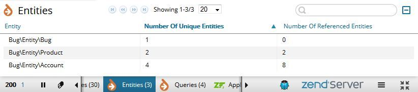
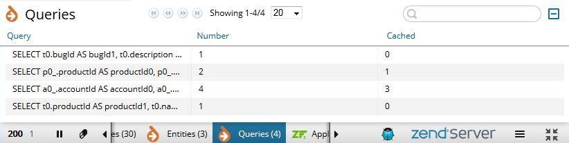

# Doctrine 2 Extension for Zend Server Z-Ray

> Displays information about your Doctrine entities

> Displays information about your Doctrine queries

This is an extension to add functionality to the Zend Server Z-Ray. It will result in additional tab(s) to be presented in the browser.

 * **Every change is tracked**. Want to know whats new? Take a look at [CHANGELOG.md](CHANGELOG.md)
 * **Listen to your ideas.** Have a great idea? Bring your pull request or open a new issue. See [CONTRIBUTING.md](CONTRIBUTING.md)

## Installation

- Copy the content of `src` directory to

```
    /usr/local/zend/var/zray/extensions/Doctrine2
```

Or equivalent install location on Windows. The `Doctrine2` directory on the server should look like this:

```
DoctrineOrm.php
logo.png
zray.php
```

## Doctrine 2 Z-Ray in action

After installation was successful, there are additional tabs in the Z-Ray toolbar.

### Tab Entities


The `Entities` tab displays information about used entities of the current page. There are the following columns:
  
 * **Entity**: FCQN of the entity class
 * **Number Of Unique Entities**: This is how many unique objects of this entity exist
 * **Number Of Referenced Entities**: This is how many references exist for this entity

### Tab Queries


The `Queries` tab displays information about executed queries. There are the following columns:

 * **Query**: The executed query
 * **Number**: The number of executions e.g. with different parameters
 * **Cached**: The number of cached queries

Note that real queries are calculated with `Number - Cached`.
