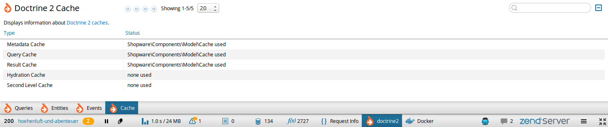

# Doctrine 2 plugin for Zend Server Z-Ray

> Displays information about your Doctrine 2 entities

> Displays information about your Doctrine 2 queries

> Displays information about your Doctrine 2 caches

This is a plugin to add functionality to the Zend Server Z-Ray. It will result in additional tab(s) to be presented in the browser.

 * **Every change is tracked** Want to know whats new? Take a look at [CHANGELOG.md](CHANGELOG.md)
 * **Listen to your ideas** Have a great idea? Bring your pull request or open a new issue. See [CONTRIBUTING.md](CONTRIBUTING.md)
 * **Looking for a demo** You can use the [Shopware demo]() to try out the Doctrine 2 Z-Ray plugin 

## Installation
Simply install the Doctrine 2 Z-Ray plugin via the Zend Server plugin gallery.

## Doctrine 2 Z-Ray in action
After installation was successful, there are additional tabs in the Z-Ray toolbar.

### Tab Entities

The `Entities` tab displays information about used entities of the current page and entity mappings. 
There are the following columns:

 * **Entity**: FCQN of the entity class
 * **Number Of Unique Entities**: How many unique objects of this entity exist
 * **Number Of Referenced Entities**: How many references exist for this entity

### Tab Queries

The `Queries` tab displays information about executed queries. There are the following columns:

 * **Query**: The executed query with parameter
 * **Number**: The number of executions e.g. with different parameters
 * **Cached**: The number of cached queries

Note that real queries are calculated with `Number - Cached`.

### Tab Cache

The `Cache` tab displays information about Doctrine 2 caches.

## More Info
Want to extend the Doctrine 2 Z-Ray extension? Looking for more information on Z-Ray? Try these links:

- [Z-Ray Documentation](https://github.com/zend-server-plugins/Documentation)
- [Zend.com](http://www.zend.com/en/products/server/z-ray)
